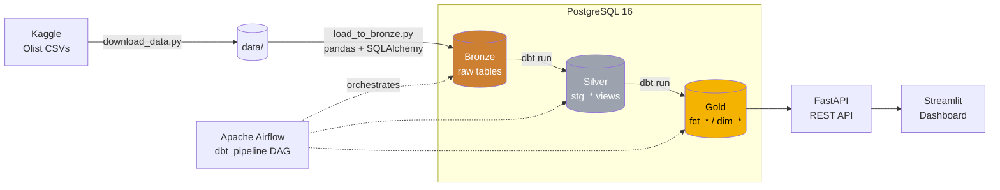

<div align="center">

# 🛒 Brazilian E-Commerce Data Platform

**An end-to-end, containerized data platform on the Olist Brazilian e-commerce dataset —
from raw CSVs to a governed warehouse, an analytics API, and an interactive dashboard.**

[](https://github.com/SualpGokalp/Brazilian-ecommerce-data-platform/actions/workflows/ci.yml)
[](https://www.python.org/)
[](https://www.getdbt.com/)
[](https://airflow.apache.org/)
[](https://www.postgresql.org/)
[](https://fastapi.tiangolo.com/)
[](https://streamlit.io/)
[](https://www.docker.com/)
[](LICENSE)

</div>


---

## 📌 Overview

This project implements a **Medallion architecture** (Bronze → Silver → Gold) data platform
over the [Olist Brazilian e-commerce dataset](https://www.kaggle.com/datasets/olistbr/brazilian-ecommerce)
(~100K orders, 2016–2018). It covers the full lifecycle of a modern data stack:

- **Ingest** raw CSVs into a PostgreSQL **Bronze** layer (idempotent loads)
- **Transform & test** with **dbt** — clean **Silver** staging models and a dimensional **Gold** layer
- **Orchestrate** the whole pipeline with **Apache Airflow** (ingestion → run → test → docs)
- **Serve** business metrics through a **FastAPI** REST API
- **Visualize** them in an interactive **Streamlit + Plotly** dashboard

Everything runs locally with Docker — no cloud account required.

## 🏗️ Architecture



**Orchestrated DAG:** `ingestion` → `dbt run` → `dbt test` → `dbt docs generate`

## 🧰 Tech Stack

| Layer | Technology |
|-------|-----------|
| **Storage / Warehouse** | PostgreSQL 16 |
| **Ingestion** | Python, pandas, SQLAlchemy, kagglehub |
| **Transformation** | dbt (dbt-postgres) — medallion models + data tests |
| **Orchestration** | Apache Airflow 3.0 (CeleryExecutor) |
| **API** | FastAPI + Uvicorn |
| **Dashboard** | Streamlit + Plotly |
| **Infrastructure** | Docker & Docker Compose |

## 📊 Key Insights

Derived from the Gold layer and surfaced through the API / dashboard:

| Metric | Value |
|--------|-------|
| 🧾 Total orders | **98,666** |
| 💰 Total revenue | **R$ 13.59M** |
| 🛍️ Avg. order value | **R$ 137.75** |
| 🚚 Total freight | **R$ 2.25M** |
| ✅ Delivery success rate | **~97%** of orders delivered |

- **São Paulo (SP)** dominates revenue (~R$ 5M), far ahead of Rio de Janeiro and Minas Gerais.
- **`bed_bath_table`, `health_beauty` and `sports_leisure`** are the top-selling categories.
- **Delivery times are highly regional** — remote northern states (RR, AP, AM) average ~26–30 days
  vs. ~8 days in the southeast, a clear logistics signal.
- Most orders fall in the **R$ 0–200** range; high-value (R$ 500+) orders are a small minority.

## 🖼️ Screenshots

<table>
  <tr>
    <td width="50%"><b>Airflow — end-to-end pipeline</b><br/></td>
    <td width="50%"><b>FastAPI — Swagger UI</b><br/></td>
  </tr>
  <tr>
    <td><b>Dashboard — categories & states</b><br/></td>
    <td><b>Dashboard — delivery & order value</b><br/></td>
  </tr>
</table>

## 📁 Project Structure

```
brazilian-ecommerce-data-platform/
├── docker-compose.yml          # PostgreSQL warehouse + shared network
├── data/                       # Raw Olist CSVs (git-ignored)
├── ingestion/                  # CSV → PostgreSQL Bronze
│   ├── download_data.py        # Pull dataset from Kaggle
│   └── load_to_bronze.py       # Idempotent load into bronze.*
├── dbt/ecommerce/              # dbt project
│   └── models/
│       ├── silver/             # stg_* staging views + sources + tests
│       └── gold/               # fct_orders, dim_customers, dim_products
├── airflow/                    # Orchestration
│   ├── Dockerfile              # Airflow + isolated dbt / ingestion venvs
│   ├── docker-compose.yaml     # Airflow stack (joins the shared network)
│   └── dags/dbt_pipeline.py    # ingestion → run → test → docs
├── api/                        # FastAPI serving the Gold layer
│   └── main.py
├── dashboard/                  # Streamlit + Plotly dashboard
│   └── app.py
├── requirements.txt
└── README.md
```

## 🧱 Data Model (Medallion)

| Layer | Schema | Contents |
|-------|--------|----------|
| **Bronze** | `bronze` | Raw CSVs loaded 1:1 (orders, order_items, customers, products, payments, category translation) |
| **Silver** | `silver` | `stg_*` cleaned & typed staging **views** built from declared `source()`s, with `unique` / `not_null` tests on keys |
| **Gold** | `gold` | Dimensional **tables**: `fct_orders` (order-grain fact), `dim_customers`, `dim_products` (with English category names) |

## 🚀 Quick Start

> Prerequisites: Docker Desktop, Python 3.12, a Kaggle account (for the dataset).

```bash
# 0. Clone
git clone https://github.com/SualpGokalp/Brazilian-ecommerce-data-platform.git
cd Brazilian-ecommerce-data-platform

# 1. Create your .env (DB credentials)  — see the example below
cp .env.example .env   # then edit if needed

# 2. Bring up the whole serving stack with ONE command
#    (PostgreSQL + FastAPI + Streamlit dashboard)
docker compose up -d --build
#    -> API   : http://localhost:8000/docs
#    -> Dash  : http://localhost:8501

# 3. Install Python deps & download the dataset (for the pipeline)
python -m pip install -r requirements.txt
python ingestion/download_data.py

# 4. Load the data — (Option A) manually
python ingestion/load_to_bronze.py             # raw -> bronze
cd dbt/ecommerce && dbt run && dbt test         # bronze -> silver -> gold

# 4. Load the data — (Option B) orchestrated with Airflow
cd airflow && docker compose up -d              # open http://localhost:8080
#   then trigger the `dbt_pipeline` DAG
```

> Once the data is loaded, refresh the dashboard at **http://localhost:8501**.
> The API and dashboard run as containers; the warehouse persists in a Docker volume.

**`.env` example**

```env
POSTGRES_USER=dbt_user
POSTGRES_PASSWORD=dbt_password
POSTGRES_DB=ecommerce
POSTGRES_HOST=localhost
POSTGRES_PORT=5432
```

## 🔌 API Endpoints

Base URL: `http://localhost:8000` · interactive docs at `/docs`

| Method | Endpoint | Description |
|--------|----------|-------------|
| `GET` | `/health` | DB connectivity check |
| `GET` | `/summary` | Total orders, revenue, AOV, freight |
| `GET` | `/revenue-by-state` | Order count & revenue per state |
| `GET` | `/order-status` | Distribution of order statuses |
| `GET` | `/top-categories?limit=` | Best-selling product categories |
| `GET` | `/monthly-orders` | Orders & revenue over time |
| `GET` | `/avg-delivery-time` | Avg delivery days per state |
| `GET` | `/order-value-distribution` | Orders bucketed by price range |
| `GET` | `/top-cities?limit=` | Cities with the most orders |

Example — a live `GET /monthly-orders` response in the Swagger UI:


## 🗺️ Roadmap

- [x] PostgreSQL warehouse + Docker Compose
- [x] Bronze ingestion (idempotent CSV → PostgreSQL)
- [x] dbt Silver staging models + sources + data tests
- [x] dbt Gold dimensional models (`fct_orders`, `dim_customers`, `dim_products`)
- [x] Airflow end-to-end DAG (ingestion → run → test → docs)
- [x] FastAPI analytics API (9 endpoints)
- [x] Streamlit + Plotly dashboard
- [x] CI (GitHub Actions: ruff lint + dbt validate on a throwaway Postgres)
- [ ] Incremental models & snapshots (SCD2)
- [x] Containerize the API + dashboard into the compose stack (`docker compose up`)
- [ ] Publish dbt docs (lineage) to GitHub Pages

## 📚 Dataset & License

- Dataset: [Olist Brazilian E-Commerce Public Dataset](https://www.kaggle.com/datasets/olistbr/brazilian-ecommerce) (CC BY-NC-SA 4.0)
- Code: [MIT](LICENSE) © 2026 Sualp Gökalp
