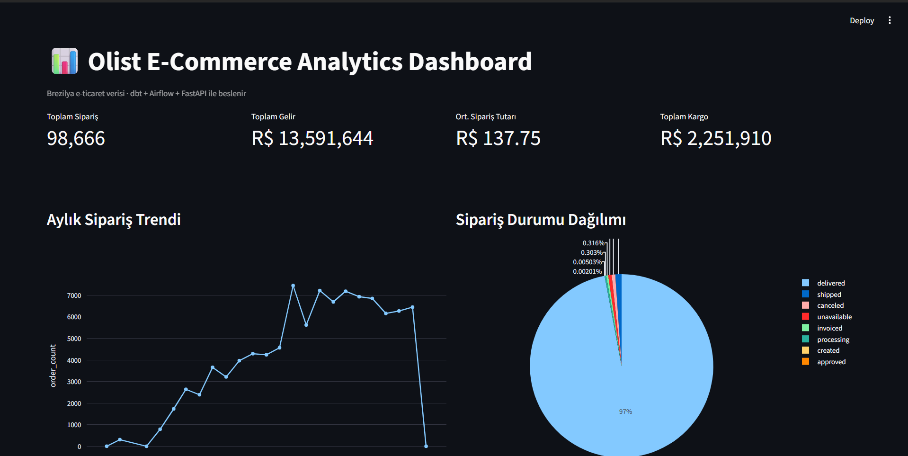
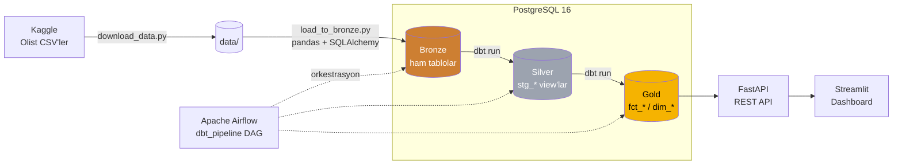
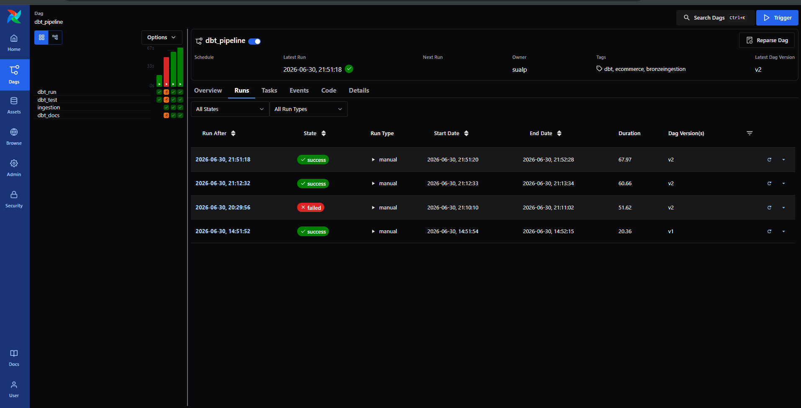
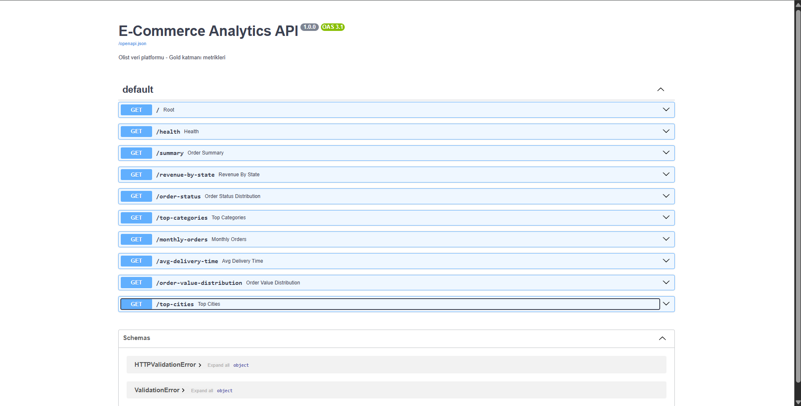
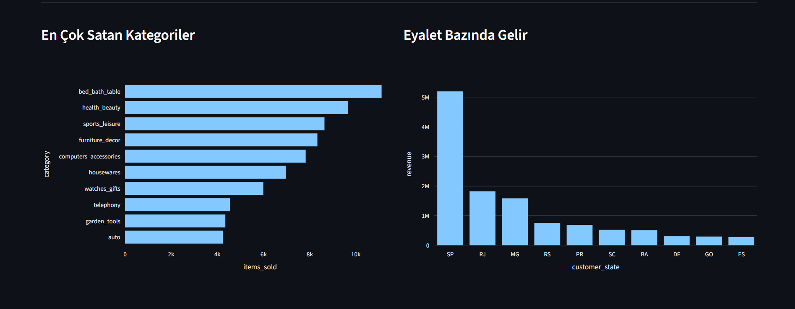
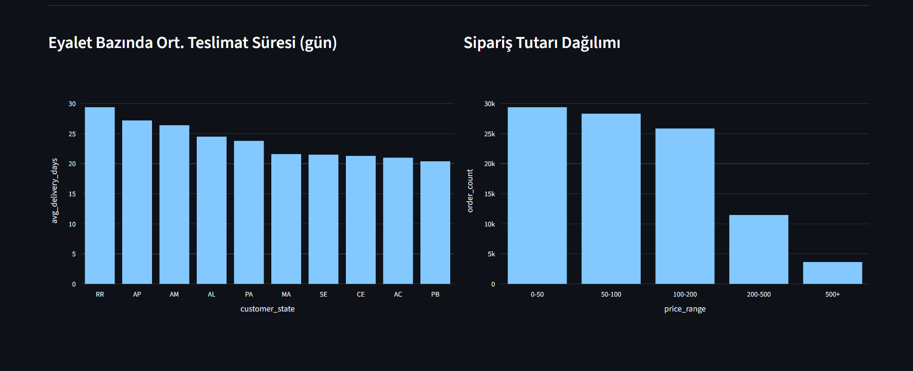
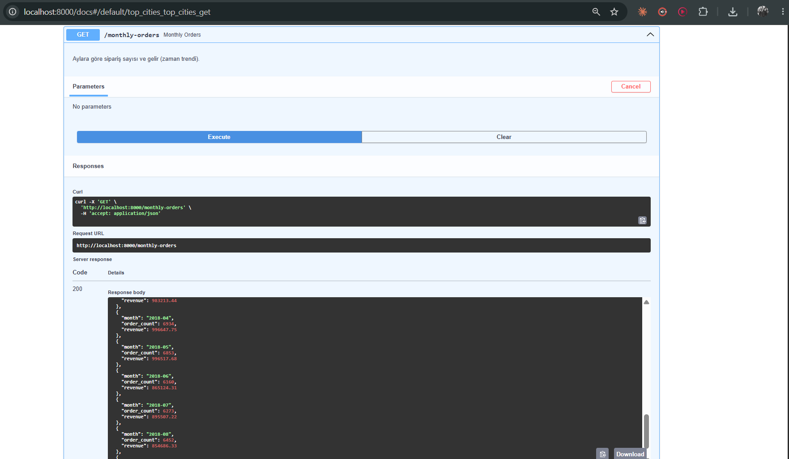

<div align="center">

# 🛒 Brezilya E-Ticaret Veri Platformu

**Olist Brezilya e-ticaret veri seti üzerine kurulu, uçtan uca ve container'lı bir veri platformu —
ham CSV'den yönetilen bir veri ambarına, analiz API'sine ve interaktif dashboard'a.**

[](https://github.com/SualpGokalp/Brazilian-ecommerce-data-platform/actions/workflows/ci.yml)
[](https://www.python.org/)
[](https://www.getdbt.com/)
[](https://airflow.apache.org/)
[](https://www.postgresql.org/)
[](https://fastapi.tiangolo.com/)
[](https://streamlit.io/)
[](https://www.docker.com/)
[](LICENSE)

[🇬🇧 English](README.md) · **🇹🇷 Türkçe** &nbsp;|&nbsp; [📊 Canlı dbt Docs](https://sualpgokalp.github.io/Brazilian-ecommerce-data-platform/)

</div>



---

## 📌 Genel Bakış

Bu proje, [Olist Brezilya e-ticaret veri seti](https://www.kaggle.com/datasets/olistbr/brazilian-ecommerce)
(~100K sipariş, 2016–2018) üzerine bir **Medallion mimarisi** (Bronze → Silver → Gold) veri platformu kurar.
Modern bir veri yığınının tüm yaşam döngüsünü kapsar:

- Ham CSV'leri PostgreSQL **Bronze** katmanına **yükleme** (idempotent — tekrar çalıştırınca bozulmaz)
- **dbt** ile **dönüştürme & test** — temiz **Silver** staging modelleri ve boyutsal **Gold** katmanı
- Tüm pipeline'ı **Apache Airflow** ile **orkestrasyon** (yükleme → run → snapshot → test → docs)
- İş metriklerini **FastAPI** REST API ile **sunma**
- Metrikleri interaktif **Streamlit + Plotly** dashboard'da **görselleştirme**

Her şey Docker ile lokalde çalışır — bulut hesabı gerekmez.

## 🏗️ Mimari



**Orkestre DAG:** `ingestion` → `dbt run` → `dbt snapshot` → `dbt test` → `dbt docs generate`

## 🧰 Teknoloji Yığını

| Katman | Teknoloji |
|--------|-----------|
| **Depolama / Ambar** | PostgreSQL 16 |
| **Yükleme (Ingestion)** | Python, pandas, SQLAlchemy, kagglehub |
| **Dönüştürme** | dbt (dbt-postgres) — medallion modelleri + veri testleri |
| **Orkestrasyon** | Apache Airflow 3.0 (CeleryExecutor) |
| **API** | FastAPI + Uvicorn |
| **Dashboard** | Streamlit + Plotly |
| **Altyapı** | Docker & Docker Compose |

## 📊 Öne Çıkan Bulgular

Gold katmanından türetilip API / dashboard üzerinden sunulur:

| Metrik | Değer |
|--------|-------|
| 🧾 Toplam sipariş | **98.666** |
| 💰 Toplam gelir | **R$ 13,59M** |
| 🛍️ Ort. sipariş tutarı | **R$ 137,75** |
| 🚚 Toplam kargo | **R$ 2,25M** |
| ✅ Teslimat başarı oranı | siparişlerin **~%97**'si teslim edildi |

- **São Paulo (SP)** gelirde açık ara lider (~R$ 5M), Rio de Janeiro ve Minas Gerais'in çok önünde.
- **`bed_bath_table`, `health_beauty` ve `sports_leisure`** en çok satan kategoriler.
- **Teslimat süreleri bölgeye göre çok değişken** — uzak kuzey eyaletleri (RR, AP, AM) ortalama ~26–30 gün,
  güneydoğu ise ~8 gün; net bir lojistik sinyali.
- Siparişlerin çoğu **R$ 0–200** aralığında; yüksek tutarlı (R$ 500+) siparişler küçük bir azınlık.

## 🖼️ Ekran Görüntüleri

<table>
  <tr>
    <td width="50%"><b>Airflow — uçtan uca pipeline</b><br/></td>
    <td width="50%"><b>FastAPI — Swagger arayüzü</b><br/></td>
  </tr>
  <tr>
    <td><b>Dashboard — kategoriler & eyaletler</b><br/></td>
    <td><b>Dashboard — teslimat & sipariş tutarı</b><br/></td>
  </tr>
</table>

## 📁 Proje Yapısı

```
brazilian-ecommerce-data-platform/
├── docker-compose.yml          # PostgreSQL ambarı + paylaşılan ağ
├── data/                       # Ham Olist CSV'leri (git-ignore'lu)
├── ingestion/                  # CSV → PostgreSQL Bronze
│   ├── download_data.py        # Veri setini Kaggle'dan çek
│   └── load_to_bronze.py       # bronze.* içine idempotent yükleme
├── dbt/ecommerce/              # dbt projesi
│   ├── models/
│   │   ├── silver/             # stg_* staging view'lar + source'lar + testler
│   │   └── gold/               # fct_orders (incremental), dim_customers, dim_products
│   └── snapshots/              # SCD2 geçmişi (scd_customers, scd_products)
├── airflow/                    # Orkestrasyon
│   ├── Dockerfile              # Airflow + izole dbt / ingestion venv'leri
│   ├── docker-compose.yaml     # Airflow yığını (paylaşılan ağa bağlanır)
│   └── dags/dbt_pipeline.py    # ingestion → run → snapshot → test → docs
├── api/                        # Gold katmanını sunan FastAPI
│   └── main.py
├── dashboard/                  # Streamlit + Plotly dashboard
│   └── app.py
├── requirements.txt
└── README.md
```

## 🧱 Veri Modeli (Medallion)

| Katman | Şema | İçerik |
|--------|------|--------|
| **Bronze** | `bronze` | Ham CSV'ler bire bir yüklenir (orders, order_items, customers, products, payments, kategori çevirisi) |
| **Silver** | `silver` | `stg_*` temizlenmiş & tiplenmiş staging **view**'lar; tanımlı `source()`'lardan kurulur, anahtarlarda `unique` / `not_null` testleri |
| **Gold** | `gold` | Boyutsal **tablolar**: `fct_orders` (sipariş-granül fact, **incremental**), `dim_customers`, `dim_products` (İngilizce kategori adlarıyla) |
| **Snapshots** | `snapshots` | Müşteri & ürünlerin **SCD Type 2** geçmişi (`scd_customers`, `scd_products`); `dbt_valid_from` / `dbt_valid_to` alanlarıyla |

**Kullanılan ileri dbt desenleri**

- **Incremental model** — `fct_orders` her seferinde baştan kurmak yerine yalnızca en son
  yüklenenden daha yeni siparişleri işler (`is_incremental()` + `delete+insert`).
- **SCD Type 2 snapshot** — `scd_customers` / `scd_products`, dbt'nin `check` stratejisiyle
  geçmiş değişiklikleri yakalar; eski durumlar asla kaybolmaz.

## 🚀 Hızlı Başlangıç

> Gereksinimler: Docker Desktop, Python 3.12, bir Kaggle hesabı (veri seti için).

```bash
# 0. Klonla
git clone https://github.com/SualpGokalp/Brazilian-ecommerce-data-platform.git
cd Brazilian-ecommerce-data-platform

# 1. .env dosyanı oluştur (DB bilgileri) — örnek aşağıda
cp .env.example .env   # gerekirse düzenle

# 2. Tüm sunum yığınını TEK komutla ayağa kaldır
#    (PostgreSQL + FastAPI + Streamlit dashboard)
docker compose up -d --build
#    -> API   : http://localhost:8000/docs
#    -> Dash  : http://localhost:8501

# 3. Python bağımlılıklarını kur & veri setini indir (pipeline için)
python -m pip install -r requirements.txt
python ingestion/download_data.py

# 4. Veriyi yükle — (Seçenek A) elle
python ingestion/load_to_bronze.py             # ham -> bronze
cd dbt/ecommerce && dbt run && dbt test         # bronze -> silver -> gold

# 4. Veriyi yükle — (Seçenek B) Airflow ile orkestre
cd airflow && docker compose up -d              # http://localhost:8080
#   ardından `dbt_pipeline` DAG'ını tetikle
```

> Veri yüklendikten sonra dashboard'ı **http://localhost:8501** adresinde yenile.
> API ve dashboard container olarak çalışır; ambar bir Docker volume'ünde kalıcıdır.

**`.env` örneği**

```env
POSTGRES_USER=dbt_user
POSTGRES_PASSWORD=dbt_password
POSTGRES_DB=ecommerce
POSTGRES_HOST=localhost
POSTGRES_PORT=5432
```

## 🔌 API Endpoint'leri

Temel URL: `http://localhost:8000` · interaktif dokümanlar `/docs` altında

| Metod | Endpoint | Açıklama |
|-------|----------|----------|
| `GET` | `/health` | DB bağlantı kontrolü |
| `GET` | `/summary` | Toplam sipariş, gelir, ort. tutar, kargo |
| `GET` | `/revenue-by-state` | Eyalet bazında sipariş sayısı & gelir |
| `GET` | `/order-status` | Sipariş durumlarının dağılımı |
| `GET` | `/top-categories?limit=` | En çok satan ürün kategorileri |
| `GET` | `/monthly-orders` | Zamana göre sipariş & gelir |
| `GET` | `/avg-delivery-time` | Eyalet bazında ort. teslimat günü |
| `GET` | `/order-value-distribution` | Fiyat aralıklarına göre siparişler |
| `GET` | `/top-cities?limit=` | En çok sipariş veren şehirler |

Örnek — Swagger arayüzünde canlı bir `GET /monthly-orders` yanıtı:



## 🗺️ Yol Haritası

- [x] PostgreSQL ambarı + Docker Compose
- [x] Bronze yükleme (idempotent CSV → PostgreSQL)
- [x] dbt Silver staging modelleri + source'lar + veri testleri
- [x] dbt Gold boyutsal modelleri (`fct_orders`, `dim_customers`, `dim_products`)
- [x] Airflow uçtan uca DAG (ingestion → run → snapshot → test → docs)
- [x] FastAPI analiz API'si (9 endpoint)
- [x] Streamlit + Plotly dashboard
- [x] CI (GitHub Actions: ruff lint + geçici Postgres'te dbt doğrulama)
- [x] Incremental modeller & snapshot'lar (SCD2)
- [x] API + dashboard'u compose yığınına container'la (`docker compose up`)
- [x] dbt docs (lineage) → [GitHub Pages](https://sualpgokalp.github.io/Brazilian-ecommerce-data-platform/)

## 📚 Veri Seti & Lisans

- Veri seti: [Olist Brazilian E-Commerce Public Dataset](https://www.kaggle.com/datasets/olistbr/brazilian-ecommerce) (CC BY-NC-SA 4.0)
- Kod: [MIT](LICENSE) © 2026 Sualp Gökalp
